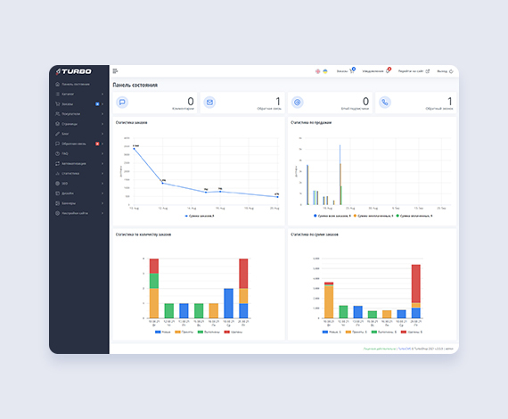

# TurboShop

## Server Requirements
- Apache
- PHP 5.2 > 8.1
- MySQL 4.1 > 8.0

## How to install

1. Copy the **install.php** file and the **turbo_soure.zip** archive to the server
2. Run the installation script. To do this, open the address `http://your_site/install.php` in your browser.
3. Follow the instructions in the installer.

## Website
- [Turbo CMS](https://turbo-cms.com/)
